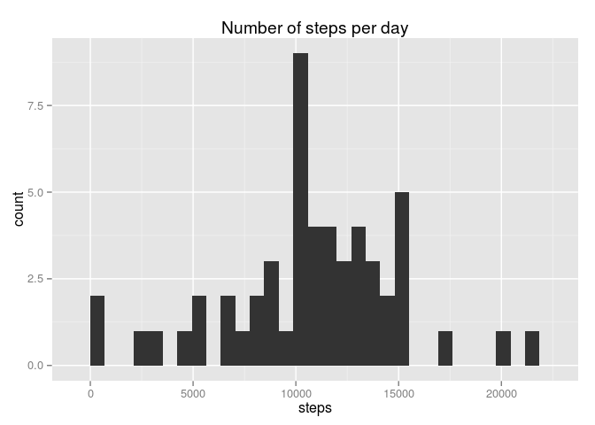
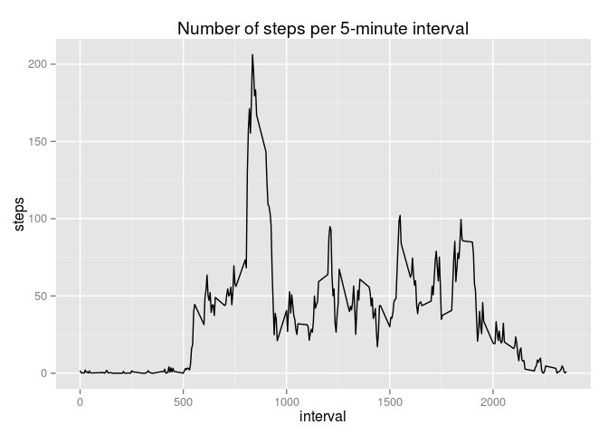
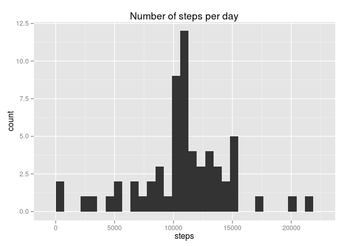
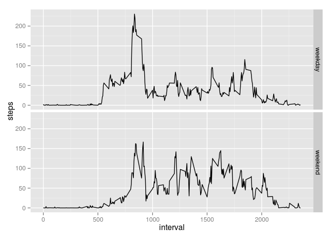

# Reproducible Research: Peer Assessment 1


## Loading and preprocessing the data

Let's load data into R


```r
activity <- read.csv("activity.csv")
```

See what data looks like.


```r
head(activity)
```

```
##   steps       date interval
## 1    NA 2012-10-01        0
## 2    NA 2012-10-01        5
## 3    NA 2012-10-01       10
## 4    NA 2012-10-01       15
## 5    NA 2012-10-01       20
## 6    NA 2012-10-01       25
```

We need a data frame without NA's so let's create one


```r
activityClean  <- subset(activity, complete.cases(activity))
head(activityClean)
```

```
##     steps       date interval
## 289     0 2012-10-02        0
## 290     0 2012-10-02        5
## 291     0 2012-10-02       10
## 292     0 2012-10-02       15
## 293     0 2012-10-02       20
## 294     0 2012-10-02       25
```

## What is mean total number of steps taken per day?

Calculate the total number of steps taken per day


```r
daySteps <- aggregate(steps ~ date, data = activityClean, FUN = sum)
head(daySteps)
```

```
##         date steps
## 1 2012-10-02   126
## 2 2012-10-03 11352
## 3 2012-10-04 12116
## 4 2012-10-05 13294
## 5 2012-10-06 15420
## 6 2012-10-07 11015
```

Plot an histogram of the total number of steps taken each day


```r
require(ggplot2)
```

```
## Loading required package: ggplot2
```

```r
qplot(x = steps, data = daySteps, main = "Number of steps per day")
```

 

Mean of number of steps per day

```r
daySteps.mean <- mean(daySteps$steps)
print(daySteps.mean)
```

```
## [1] 10766.19
```

Median of number of steps per day

```r
daySteps.median <- median(daySteps$steps)
print(daySteps.median)
```

```
## [1] 10765
```

## What is the average daily activity pattern?

Calculate the average number of steps in 5-minutes interval


```r
fiveMinSteps <- aggregate(steps ~ interval, data = activityClean, FUN = mean)

qplot(x = interval, y = steps, data = fiveMinSteps, geom = "line", main = "Number of steps per 5-minute interval")
```

 

The 5-minute interval in which we the maximum number of steps is:

```r
fiveMinSteps[which(fiveMinSteps$steps == max(fiveMinSteps$steps)),]
```

```
##     interval    steps
## 104      835 206.1698
```

## Imputing missing values

Total number of missing values in the dataset are:

```r
sum(is.na(activity$steps))
```

```
## [1] 2304
```

To fill missing value we use the mean for that 5-minute interval

```r
activityComplete <- activity
activityComplete[is.na(activityComplete),]$steps <- fiveMinSteps[match(activityComplete[is.na(activityComplete),]$interval, fiveMinSteps$interval),2]

head(activityComplete)
```

```
##       steps       date interval
## 1 1.7169811 2012-10-01        0
## 2 0.3396226 2012-10-01        5
## 3 0.1320755 2012-10-01       10
## 4 0.1509434 2012-10-01       15
## 5 0.0754717 2012-10-01       20
## 6 2.0943396 2012-10-01       25
```

Calculate the total number of steps taken per day


```r
dayStepsComplete <- aggregate(steps ~ date, data = activityComplete, FUN = sum)
head(daySteps)
```

```
##         date steps
## 1 2012-10-02   126
## 2 2012-10-03 11352
## 3 2012-10-04 12116
## 4 2012-10-05 13294
## 5 2012-10-06 15420
## 6 2012-10-07 11015
```

Plot an histogram of the total number of steps taken each day


```r
require(ggplot2)
qplot(x = steps, data = dayStepsComplete, main = "Number of steps per day")
```

 

Mean of number of steps per day

```r
dayStepsComplete.mean <- mean(dayStepsComplete$steps)
print(dayStepsComplete.mean)
```

```
## [1] 10766.19
```

Median of number of steps per day

```r
dayStepsComplete.median <- median(dayStepsComplete$steps)
print(dayStepsComplete.median)
```

```
## [1] 10766.19
```


## Are there differences in activity patterns between weekdays and weekends?

Let's create new factor variable

```r
activityComplete$weekday <- weekdays(as.Date(activityComplete$date))
activityComplete$weekday <- {activityComplete$weekday == "sabato" | activityComplete$weekday == "domenica"}
activityComplete$weekday <- factor(activityComplete$weekday, labels = c("weekday", "weekend"))

summary(activityComplete)
```

```
##      steps                date          interval         weekday     
##  Min.   :  0.00   2012-10-01:  288   Min.   :   0.0   weekday:12960  
##  1st Qu.:  0.00   2012-10-02:  288   1st Qu.: 588.8   weekend: 4608  
##  Median :  0.00   2012-10-03:  288   Median :1177.5                  
##  Mean   : 37.38   2012-10-04:  288   Mean   :1177.5                  
##  3rd Qu.: 27.00   2012-10-05:  288   3rd Qu.:1766.2                  
##  Max.   :806.00   2012-10-06:  288   Max.   :2355.0                  
##                   (Other)   :15840
```

Calculate the average number of steps in 5-minutes interval


```r
fiveMinStepsComplete <- aggregate(steps ~ interval + weekday, data = activityComplete, FUN = mean)

fiveMinStepsPlot <- ggplot(fiveMinStepsComplete, aes(x = interval, y = steps)) + geom_line()
fiveMinStepsPlot + facet_grid(weekday ~ .)
```

 
